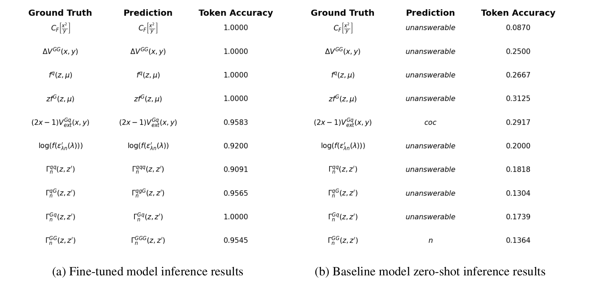
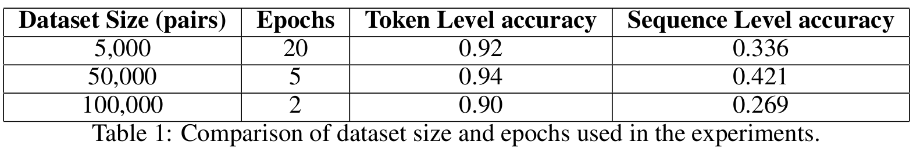

# Fine-tuning Vision Language (VLM) Model for Image to Latex Code Task ([Report](./assets/report.pdf))

### Comparision between LORA fine-tuned model and zero-shot inference:



### Some evaluation results:



### Hyperparamters:
- Learning rate: 5e-6
- Batch size: 16
- Epochs: 5
- LoRA Rank: 8
- LoRA Alpha: 16
- LoRA Dropout: 0.1
- Training dataset size: 50,000
- Validation dataset size: 5,000
- Testing dataset size: 5,000

 Note: Further explaination on the project please check the [report](./assets/report.pdf)

### Files:
1. `lora.py`: Includes all the code for lora linear layers and lora model
2. `Train.py`:  All the code for training
3. `utils.py`: All the helper funtions we need for training and testing
4. `eval.py`: All the code for evaluating your model
5. `baseline_inference.py`: All the code we need for zero shot inference on our baseline model Florence-2
6. `render.py`: All the code for rendering the evaluation result into images
7. `requirements.txt`: All the require packages for our virtual env
8. `best_result/`: The best results we trained


### Run the code:

1. Set up virtual env:
```Bash
conda create -n vlm_env python==3.12 -y
conda activate vlm_env
pip install -r requirements.txt
```

2. Run our pretrain weights
```Bash
python eval.py
```

3. Run our baseline model
```Bash
python baseline_inference.py
```

4. Compile the code we generate and see the render results
```Bash
python render.py
```


